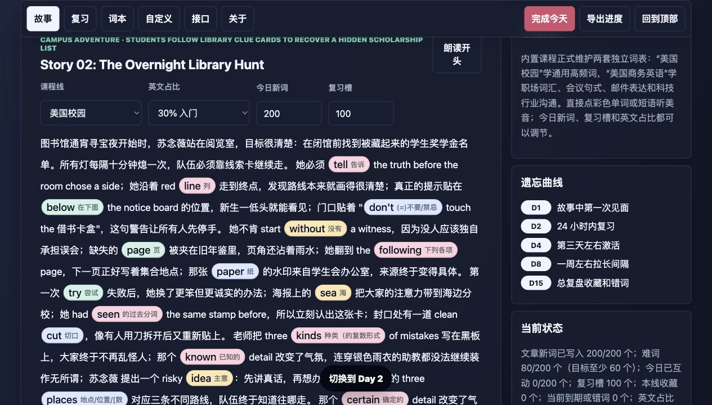
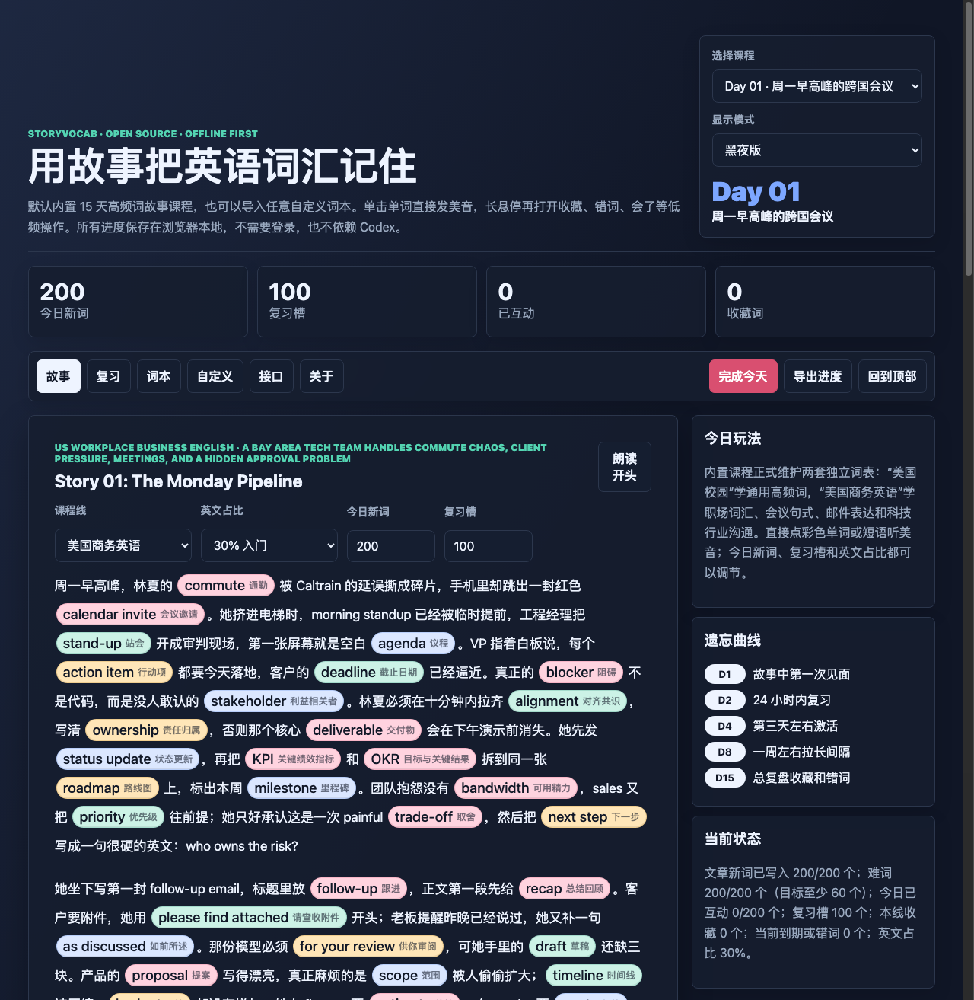
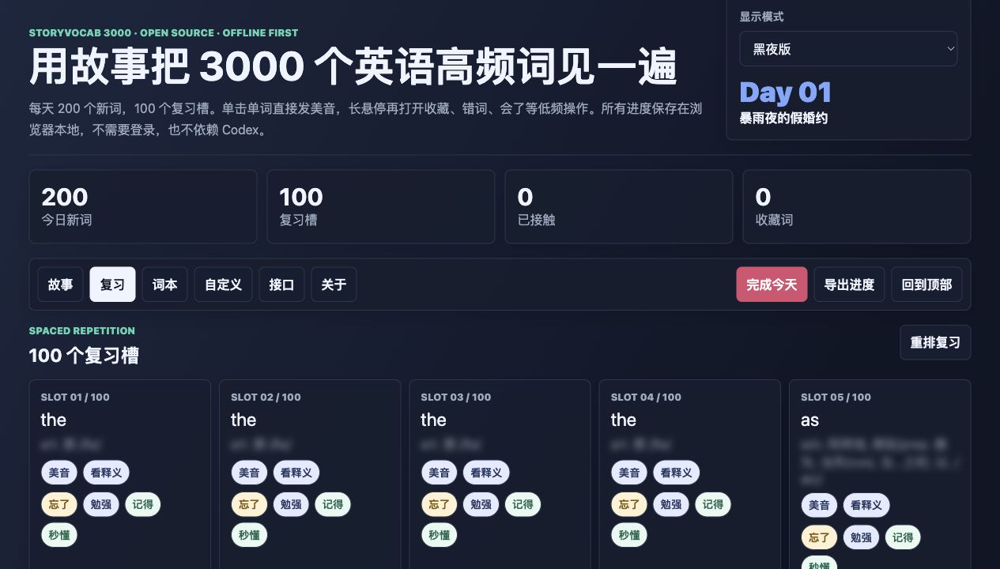
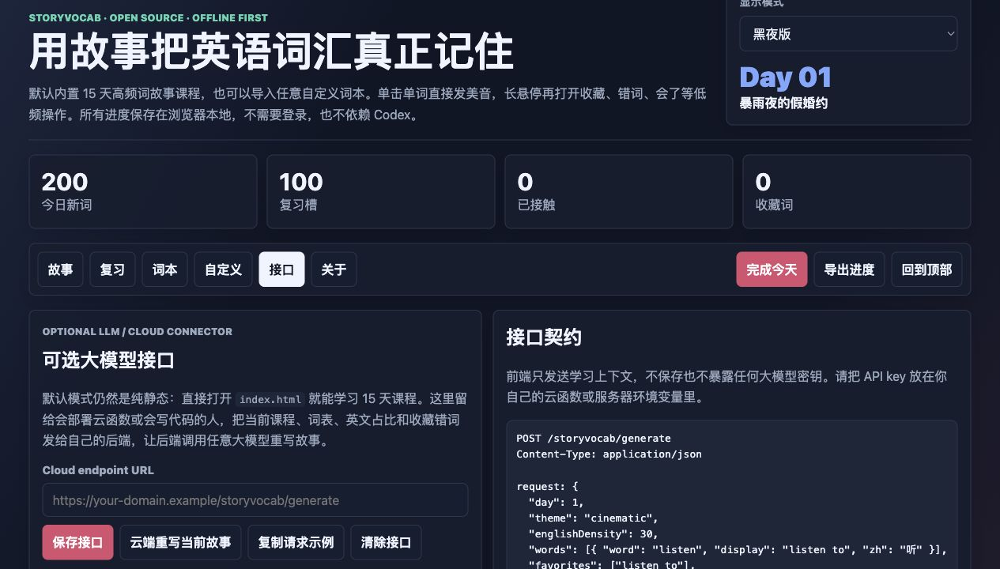
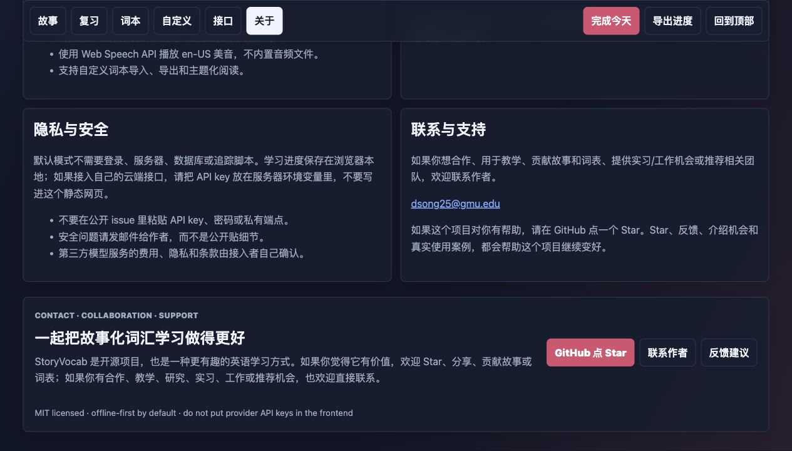

# StoryVocab

StoryVocab is an offline-first, zero-dependency web app for learning English vocabulary through vivid daily stories, colorful word chips, one-click American pronunciation, spaced repetition, and custom wordbooks.

StoryVocab 是一个离线优先、零依赖的英语词汇学习网页。它用生动故事、彩色单词卡片、一键美音发音、遗忘曲线复习和自定义词本，帮助中文学习者把单词放进更容易记住的语境里。

It is designed for Chinese-speaking learners who want a more memorable alternative to alphabetical word lists. The default pack now has two maintained course lines: an American-campus high-frequency vocabulary story line and an independent US workplace/business English line with its own business words, phrases, and sentence patterns. Custom words, custom prompts, and cloud-generated rewrites remain open extension points.

这个项目主要面向中文学习者，目标是替代那种按字母顺序硬背单词的枯燥方式。默认课程现在维护两条课程线：美国校园线继续学习通用高频词，美国职场/商务英语线使用独立商务词表，包含职场词汇、商务短语和常用句式。自定义词本、自定义主题和云端大模型重写接口仍然保留给需要扩展的人。

Live demo: https://songdc98.github.io/storyvocab/

在线演示：https://songdc98.github.io/storyvocab/



## Why StoryVocab / 为什么做 StoryVocab

Most vocabulary tools make learners stare at isolated words. StoryVocab puts words back into scenes, conflict, emotion, and repeated choices. The goal is simple: make word memory feel closer to reading a vivid story than grinding a list.

很多背单词工具让人面对孤立词条，很难留下画面感。StoryVocab 把单词放回场景、冲突、情绪和反复选择里，让记忆更像读一篇有剧情的故事，而不是机械刷列表。

## Features / 功能特点

- **Adjustable daily load**: start from the default 200 new words and 100 review slots, then tune both counts for the day.
- **Clear coverage status**: the page separates words written into the story from words the learner has clicked or reviewed.
- **Story-first reading**: words are mixed by frequency and story context instead of alphabetic order.
- **Low-value target filtering**: Day 01 no longer treats glue words like `the`, `what`, `this`, single letters, or standalone names as the main learning chips.
- **Gentle difficulty ramp**: Day 01 stays easy to enter, then later days surface slightly richer words earlier in each story.
- **Two maintained course lines**: the campus line uses the original high-frequency vocabulary course, while the business English line uses a separate business vocabulary and sentence-pattern pack.
- **Authored daily episodes**: Day 01 includes both a storm-night campus scholarship gamble and a Bay Area tech-workplace business article; the business article covers 200 independent workplace targets instead of reusing the campus word list.
- **Hard-word quota**: Day 03 and later lessons front-load at least 30% harder words in the daily study set, so a 200-word day includes at least 60 challenge words.
- **Independent daily campus stories**: American-campus Day 02-15 now use standalone campus stories with their own setting, conflict, turn, and ending, so each lesson can stay logical without forcing every word into one repetitive case line.
- **Usage-aware contexts**: story sentences should place words in natural grammar, for example `below the notice board` instead of treating `below` as a standalone label.
- **Semantic campus scenes**: the American-campus Day 02-15 generator places chips into actions, relations, objects, and scene details that match the day’s story instead of dropping words into unrelated Chinese narration.
- **Semantic-fit story writing**: unusual or abstract scenes are allowed, but each word chip must still belong to the sentence logic instead of being dropped in as decoration.
- **Story quality gate**: authored lessons are checked for word coverage, known awkward usage patterns, and repeated Chinese-English phrasing before release.
- **Maintainer requirements**: product/story rules are tracked in [docs/PROJECT_REQUIREMENTS.md](docs/PROJECT_REQUIREMENTS.md) so future edits preserve the same expectations.
- **Adjustable English density**: switch the story between roughly 30%, 50%, and 90% English for a gradual difficulty climb.
- **Phrase-aware chips**: common words can appear as natural phrases such as `listen to`, `depend on`, and `according to`.
- **Light and dark themes**: the app opens in dark mode by default and lets learners switch back to a bright reading theme.
- **One-click en-US pronunciation**: click any colored word chip to hear American pronunciation through the browser Web Speech API.
- **Phonetic hover titles**: long-hover menus show pronunciation first; business phrases display one phonetic unit per English word instead of internal labels such as `business word`.
- **Low-friction word actions**: long hover over a word to open actions for favorite, known, and review.
- **Spaced repetition**: configurable review slots, weighted by due date, favorites, and wrong words.
- **Local progress**: progress stays in browser `localStorage`; no account or server needed.
- **Custom wordbook**: import your own words with `word,中文释义,pos` lines.
- **Custom theme reading**: turn imported words into a themed reading passage without external services.
- **Optional cloud/LLM connector**: keep the app fully static by default, or connect your own endpoint to rewrite lessons with any model provider.
- **Developer API**: `window.StoryVocabAPI` exposes lesson state, current words, connector payloads, external story rendering, and pronunciation helpers.

- **每日学习量可调**：默认每天 200 个新词、100 个复习槽，也可以按当天状态调整。
- **进度表达清楚**：页面会区分“文章已经写入的词”和“学习者已经点击或复习过的词”。
- **故事优先**：单词按频率、难度和故事语境混合出现，不按字母顺序硬排。
- **低价值词过滤**：Day 01 不再把 `the`、`what`、`this`、单个字母或孤立人名当成主要学习卡片。
- **难度渐进**：第一天容易进入，后面逐渐把更有学习价值、更有挑战的词提前展示。
- **两条正式课程线**：校园线使用原来的通用高频词课程；商务英语线使用另一套独立商务词汇和句式包，不再只是把同一批词换个故事风格。
- **手写章节**：Day 01 同时包含暴雨夜校园奖学金赌约和湾区科技职场商务英语文章；商务文章覆盖 200 个独立职场目标词/短语/句式，而不是复用校园词表。
- **难词比例**：Day 03 及后续课程会优先保证至少 30% 的较难词，一个 200 词日里至少有 60 个挑战词。
- **独立校园日故事**：美国校园 Day 02-15 现在改成每天一个独立校园短篇，每天都有自己的场景、冲突、转折和结尾，避免把所有词硬塞进同一条重复案子线。
- **用法贴合**：单词要放在自然语法里，例如 `below the notice board`，而不是把 `below` 当孤立标签。
- **校园语义场景**：美国校园 Day 02-15 的生成器会把词放进动作、关系、物件和场景细节里，让中文内容和英文目标词有真实联系，不再随便丢词。
- **语义贴合**：故事可以夸张、抽象、荒诞，但每个词必须在句子逻辑里有作用，不能随便丢进去。
- **质量检查**：发布前会检查词覆盖、已知别扭用法、中英文重复和语义不贴合问题。
- **维护规则**：产品和故事要求记录在 [docs/PROJECT_REQUIREMENTS.md](docs/PROJECT_REQUIREMENTS.md)，方便后续修改保持一致。
- **英文占比可调**：可以在约 30%、50%、90% 英文之间切换，逐步提高阅读难度。
- **短语感知**：常见词会尽量以真实短语出现，例如 `listen to`、`depend on`、`according to`。
- **亮暗模式**：默认黑夜版，也可以切换到亮版阅读。
- **一键美音**：点击任何彩色词或短语，就能通过浏览器 Web Speech API 听美音。
- **音标优先**：长悬停菜单先显示音标；商务短语会按英文词逐个显示音标，不再显示 `business word` 这类内部标签。
- **低干扰操作**：长悬停才打开收藏、会了、复习等低频操作。
- **遗忘曲线复习**：复习槽会根据到期词、收藏词、错词加权出现。
- **本地进度**：学习记录存在浏览器 `localStorage`，不需要账号或服务器。
- **自定义词本**：支持用 `word,中文释义,pos` 格式导入自己的词。
- **自定义主题阅读**：不接外部服务，也能把导入词生成一段主题阅读。
- **可选云端/大模型接口**：默认完全静态；需要时可以接自己的后端，让任意模型重写故事。
- **开发者 API**：`window.StoryVocabAPI` 暴露课程状态、当前词表、接口 payload、外部故事渲染和发音方法。

## Screenshots / 截图

### Daily Story / 每日故事


### Business English Track / 商务英语线



### Review Slots / 复习槽



### Wordbook Search / 词本搜索


### Optional Connector / 可选接口



### Privacy, Contact, And Support / 隐私、联系与支持



## Quick Start / 快速开始

Open `index.html` directly in a browser:

直接在浏览器里打开 `index.html`：

```text
file:///path/to/storyvocab/index.html
```

Or host the folder with any static server:

也可以用任意静态服务器托管这个文件夹：

```bash
python3 -m http.server 8765
```

Then visit:

然后访问：

```text
http://127.0.0.1:8765
```

## Deploy To GitHub Pages / 部署到 GitHub Pages

1. Create a new public GitHub repository.
2. Upload or push this project folder.
3. In the repository settings, open **Pages**.
4. Choose **Deploy from a branch**.
5. Select branch `main` and folder `/ (root)`.
6. Save. GitHub will publish the app as a public website.

1. 创建一个新的公开 GitHub 仓库。
2. 上传或推送这个项目文件夹。
3. 进入仓库设置里的 **Pages**。
4. 选择 **Deploy from a branch**。
5. 分支选 `main`，目录选 `/ (root)`。
6. 保存后，GitHub 会把这个项目发布成公开网页。

## Custom Wordbook Format / 自定义词本格式

Paste one word per line:

每行粘贴一个词：

```csv
privacy,隐私,n.
launch,发布/发射,v.
evidence,证据,n.
```

Then click **导入自定义词**. Imported words can be searched, favorited, reviewed, exported, and used in custom themed readings.

然后点击 **导入自定义词**。导入后的词可以搜索、收藏、复习、导出，也可以用于自定义主题阅读。

## Optional Cloud / LLM Connector / 可选云端或大模型接口

The app works without any backend. If you want model-generated stories, open **接口**, paste your own endpoint URL, and click **云端重写当前故事**.

这个应用不需要任何后端也能使用。如果你想接入模型生成故事，可以打开 **接口**，粘贴自己的 endpoint URL，然后点击 **云端重写当前故事**。

Security rule: do not put model provider API keys in this static frontend. Put keys in your own server, Cloudflare Worker, Vercel Function, or other cloud function, then let StoryVocab call that endpoint.

安全规则：不要把模型服务商 API key 放进这个静态前端。API key 应该放在你自己的服务器、Cloudflare Worker、Vercel Function 或其他云函数里，再让 StoryVocab 调用你的后端接口。

Expected request shape:

请求格式示例：

```json
{
  "app": "StoryVocab",
  "day": 1,
  "theme": "campus",
  "englishDensity": 30,
  "words": [
    { "word": "listen", "display": "listen to", "zh": "听" }
  ],
  "favorites": ["listen to"],
  "reviewWords": ["depend on"]
}
```

Expected response shape:

响应格式示例：

```json
{
  "storyText": "一篇新的故事...",
  "notes": "Optional note"
}
```

The returned text is displayed in the connector preview and does not overwrite the built-in 15-day static lessons. A starter endpoint template is available at [examples/cloud-endpoint-template.js](examples/cloud-endpoint-template.js).

返回的文本会显示在接口预览区，不会覆盖内置 15 天静态课程。项目里提供了一个后端接口模板：[examples/cloud-endpoint-template.js](examples/cloud-endpoint-template.js)。

Developers can also extend the page directly:

开发者也可以直接调用页面 API 扩展功能：

```js
const payload = window.StoryVocabAPI.buildConnectorPayload();
window.StoryVocabAPI.renderExternalStory("A custom generated story");
window.StoryVocabAPI.speak("listen to");
```

## Privacy And Safety / 隐私与安全

- StoryVocab does not require login, analytics, cookies, or a database.
- Learning progress, favorites, wrong words, custom words, and connector URL are saved locally in your browser.
- The browser Web Speech API may use the speech engine provided by your browser or operating system.
- If you configure a cloud endpoint, StoryVocab sends the current lesson payload to that endpoint. Only connect endpoints you control and trust.
- Do not paste private API keys, passwords, private learning data, or confidential material into the static frontend.

- StoryVocab 不需要登录、统计分析、cookie 或数据库。
- 学习进度、收藏词、错词、自定义词和接口 URL 都保存在你的浏览器本地。
- 浏览器 Web Speech API 可能会使用浏览器或操作系统提供的语音引擎。
- 如果配置云端接口，StoryVocab 会把当前课程 payload 发给该接口。只连接你自己控制并信任的接口。
- 不要把私有 API key、密码、私人学习数据或机密材料粘贴进这个静态前端。

See [PRIVACY.md](PRIVACY.md) and [SECURITY.md](SECURITY.md) for the full project policy.

完整项目政策见 [PRIVACY.md](PRIVACY.md) 和 [SECURITY.md](SECURITY.md)。

## Community Files / 社区文件

This repository includes the standard public-project files people expect when contributing:

这个仓库包含公开项目通常需要的社区文件：

- [LICENSE](LICENSE): MIT License for the project code.
- [THIRD_PARTY_NOTICES.md](THIRD_PARTY_NOTICES.md): bundled vocabulary data attribution.
- [CONTRIBUTING.md](CONTRIBUTING.md): how to propose changes safely.
- [CODE_OF_CONDUCT.md](CODE_OF_CONDUCT.md): expected behavior for public collaboration.
- [SECURITY.md](SECURITY.md): how to report vulnerabilities or secret-handling issues.
- [SUPPORT.md](SUPPORT.md): where to ask questions, collaborate, or copy the author's contact email.
- [PRIVACY.md](PRIVACY.md): local-storage and optional connector privacy notes.

- [LICENSE](LICENSE)：项目代码使用 MIT License。
- [THIRD_PARTY_NOTICES.md](THIRD_PARTY_NOTICES.md)：内置词汇数据的第三方来源说明。
- [CONTRIBUTING.md](CONTRIBUTING.md)：如何安全地提出修改。
- [CODE_OF_CONDUCT.md](CODE_OF_CONDUCT.md)：公开协作的行为准则。
- [SECURITY.md](SECURITY.md)：如何报告漏洞或密钥处理问题。
- [SUPPORT.md](SUPPORT.md)：如何提问、合作或复制作者邮箱。
- [PRIVACY.md](PRIVACY.md)：本地存储和可选接口的隐私说明。

## Data Sources / 数据来源

The offline word data is generated from MIT-licensed sources:

离线词汇数据来自 MIT 许可的数据源：

- `3000-words-list@0.0.3`: 3000 frequent English words.
- `skywind3000/ECDICT`: English-Chinese glosses and phonetic hints.

- `3000-words-list@0.0.3`：3000 个常见英语词。
- `skywind3000/ECDICT`：英中释义和音标提示。

See [THIRD_PARTY_NOTICES.md](THIRD_PARTY_NOTICES.md) for details.

详细信息见 [THIRD_PARTY_NOTICES.md](THIRD_PARTY_NOTICES.md)。

## Development / 开发

No package install is required. To regenerate the lesson data after downloading the upstream sources to `/tmp`:

无需安装依赖。把上游数据下载到 `/tmp` 后，可以用下面的命令重新生成课程数据：

```bash
python3 tools/extract_lessons.py
```

The generated file is:

生成文件是：

```text
src/lessons.js
```

Before opening a pull request, check:

提交 pull request 前请检查：

```bash
node --check src/app.js
node --check examples/cloud-endpoint-template.js
node tools/check_story_quality.mjs
git diff --check
```

If your environment has `npm`, the same checks are also available as `npm run check`.

如果环境里有 `npm`，也可以运行 `npm run check` 执行同样检查。

If a change affects UI, public wording, screenshots, deployment, privacy, or security behavior, update the matching docs and screenshots in the same pull request.

如果改动影响 UI、公开文案、截图、部署、隐私或安全行为，请在同一个 pull request 里同步更新对应文档和截图。

README updates must remain bilingual: each substantial English paragraph, list, or explanation should be followed by its Chinese counterpart without splitting the translation into overly tiny sentence fragments.

README 更新必须保持中英双语：每个较完整的英文段落、列表或说明下面，都要跟对应中文；不要把翻译拆成过碎的短句，避免影响阅读理解。

## License, Attribution, And Brand Use / 许可、署名与品牌使用

StoryVocab code is released under the MIT License. See [LICENSE](LICENSE).

StoryVocab 代码使用 MIT License 发布，详见 [LICENSE](LICENSE)。

The bundled vocabulary data keeps third-party notices in [THIRD_PARTY_NOTICES.md](THIRD_PARTY_NOTICES.md). If you redistribute a modified version, keep the MIT copyright notices and third-party attributions required by the relevant licenses.

内置词汇数据的第三方说明保存在 [THIRD_PARTY_NOTICES.md](THIRD_PARTY_NOTICES.md)。如果你再分发修改版本，请保留相关许可要求的 MIT copyright notices 和第三方署名。

The project name, author identity, screenshots, and contact information should not be used to imply endorsement of unrelated products, services, or commercial offerings.

项目名称、作者身份、截图和联系方式不能被用来暗示作者为无关产品、服务或商业项目背书。

## Author, Contact, And Support / 作者、联系与支持

Created and maintained by Dachuan Song.

本项目由 Dachuan Song 创建并维护。

For collaboration, research/product ideas, educational partnerships, internship/job opportunities, or referral conversations, copy this email address:

如果想讨论合作、研究或产品想法、教育合作、实习/工作机会或内推，可以复制下面的邮箱联系：

`dsong25@gmu.edu`

If StoryVocab helps you, please star the repository:

如果 StoryVocab 对你有帮助，欢迎给仓库点一个 star：

https://github.com/songdc98/storyvocab

Stars, thoughtful issues, documentation improvements, and introductions to teams working on language learning, education tools, or human-centered AI all help the project and the author.

Star、认真提交 issue、改进文档，或者把项目介绍给做语言学习、教育工具、人本 AI 的团队，都会帮助这个项目和作者继续发展。

## Keywords / 关键词

English vocabulary, StoryVocab, high-frequency words, American pronunciation, spaced repetition, story-based learning, Web Speech API, GitHub Pages, Chinese English learning, LLM connector, cloud function, offline English learning.

英语词汇、StoryVocab、高频词、美音发音、间隔复习、故事化学习、Web Speech API、GitHub Pages、中文英语学习、大模型接口、云函数、离线英语学习。
